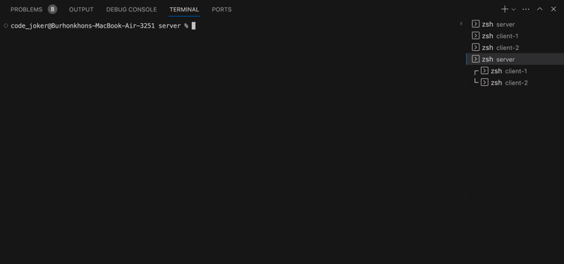

# WebSocket

This example chat with two client with `WebSocket`.

## Installation

To install and compile run following command:

```bash
npm run bootstrap
```

## Usage

1. Lets start our server:

```bash
cd ./server
npm start
```

2. Start client 1:

```bash
cd ./client-1
npm start
```

3. Start client 2:

```bash
cd ./client-2
npm start
```

4. Lets chats with clients:


